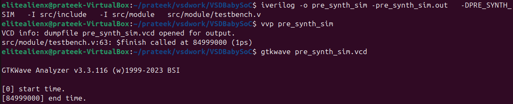
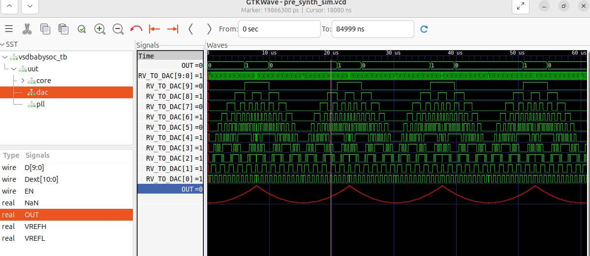

## 🚀 Week 2 – BabySoC (RISC-V) Tapeout Program  

### 🔹 Overview  
The **VSDBabySoC** is a compact, open-source educational SoC that brings together:  
- The **RVMYTH RISC-V core** (written in TL-Verilog).  
- An **8× PLL** for clock generation.  
- A **10-bit DAC** for analog signal output.  

Its goal is to provide a learning platform for SoC design and verification while staying small enough to be approachable for students and open-source contributors.  

---

### 🔹 Functional Flow  

1. **PLL Initialization**  
   - Generates a stable, synchronized clock.  
   - Ensures CPU and DAC avoid timing mismatches.  

2. **RVMYTH Processing**  
   - Cycles values in the **r17 register**.  
   - Prepares data streams for the DAC.  

3. **Digital-to-Analog Conversion**  
   - DAC converts digital data into **analog waveforms**.  
   - Output may be saved to file (`OUT`) or connected to external devices.  

---

### 🔹 Tools Required  

- **Icarus Verilog** → Compile and run RTL simulations.  
- **GTKWave** → Inspect waveforms (`.vcd` output).  
- **Yosys** → Perform logic synthesis and generate netlists.  

---

### 🔹 Workflow  

#### 1. Convert TL-Verilog (RVMYTH) to Verilog  
```bash
# Environment setup
sudo apt update
sudo apt install python3-venv python3-pip

# Create and activate virtual environment
python3 -m venv sp_env
source sp_env/bin/activate

# Install SandPiper-SaaS
pip install pyyaml click sandpiper-saas

# Convert RVMYTH TLV → Verilog
sandpiper-saas -i ./src/module/rvmyth.tlv -o rvmyth.v \
--bestsv --noline -p verilog --outdir ./src/module/
```

#### 2. Simulate using Iverilog & Gtkwave  


#### 3. Waveform  

---
### 📌 Summary  

The **BabySoC project** is an open-source, educational System-on-Chip built using the RVMYTH RISC-V core, PLL, and DAC.  
It demonstrates the **end-to-end flow of SoC design and verification** using only open-source tools.  


- Converted **TL-Verilog → Verilog** (RVMYTH core).  
- Performed **Pre-Synthesis Simulation** using Icarus Verilog + GTKWave.  
- Ran **RTL Synthesis** with Yosys to generate a gate-level netlist.  
- Validated design correctness with **Post-Synthesis Simulation (GLS)**.  
- Difference between **RTL vs GLS simulations**.  
- How a CPU, PLL, and DAC interact in a minimal SoC.  
- The importance of verifying **functionality first, timing later**.  
- Gained hands-on exposure to open-source VLSI tools (Icarus, GTKWave, Yosys).  


