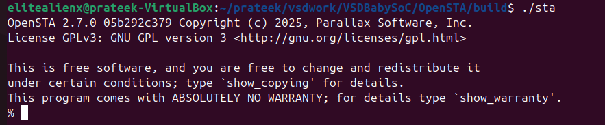
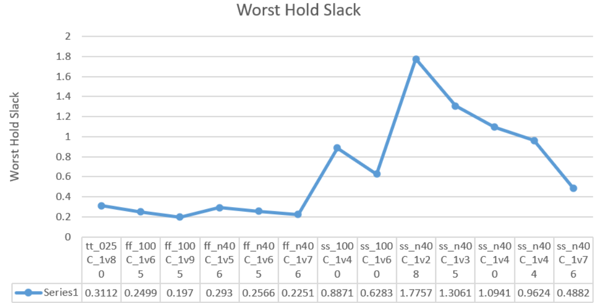
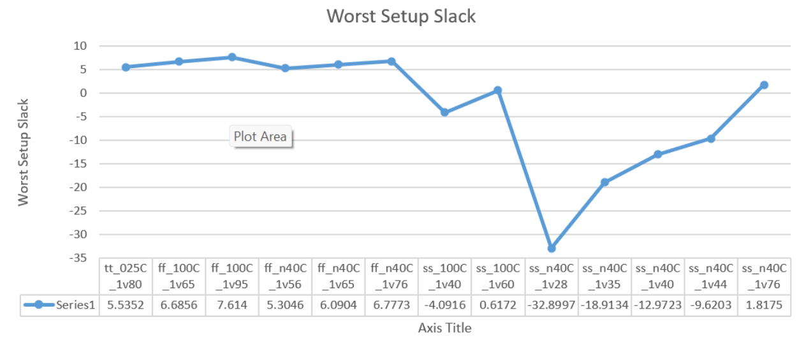
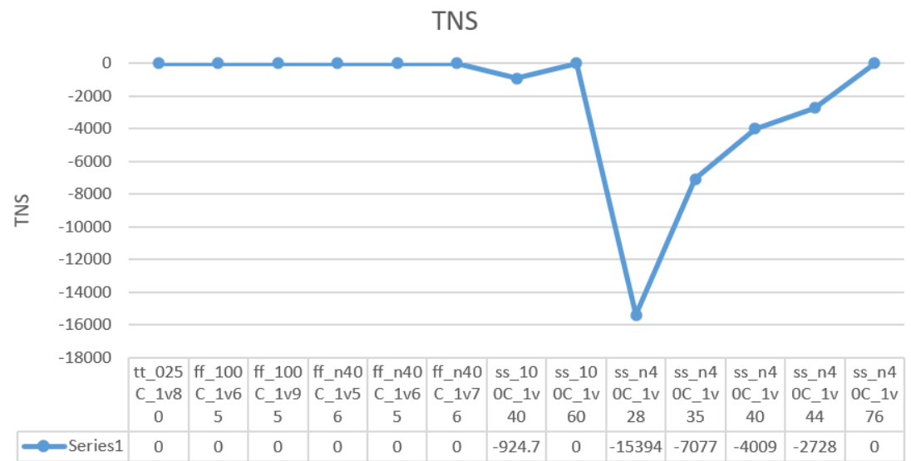
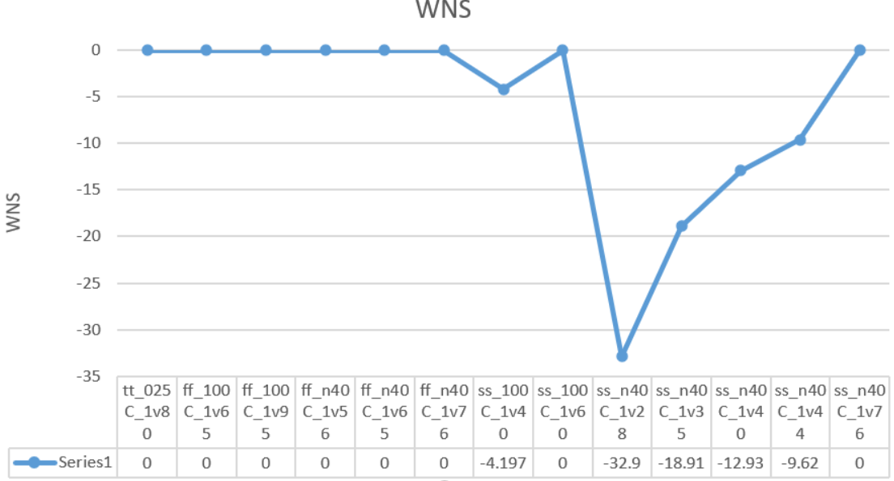

## 🧠 Post-Placement Static Timing Analysis (STA) using OpenSTA

This project demonstrates **Post-Placement Static Timing Analysis (STA)** for the **vsdbabysoc** design using **OpenSTA** and the **Sky130 PDK**.  
After routing, STA helps verify that the design meets timing constraints such as **setup** and **hold** requirements before fabrication.

---

### 📘 Overview

- **SPEF file** → Contains extracted parasitic details (resistance & capacitance) after routing.  
- **Post-placement Verilog file** → Represents the gate-level netlist after placement and routing.  
- **OpenSTA** → Used to perform static timing checks across multiple **PVT corners** (Process, Voltage, Temperature).  

The goal is to ensure that timing requirements are met under all operating conditions and to identify any critical paths or timing violations.

---

---
### ⚙️ STA TCL Script

Below is the example **TCL script** used to perform STA across the available PVT corners using the **Sky130HD** libraries.

```tcl
# -----------------------------
# Post-Placement STA TCL Script
# -----------------------------

# Design Configuration
export DESIGN_NICKNAME = vsdbabysoc
export DESIGN_NAME     = vsdbabysoc
export PLATFORM        = sky130hd

# Verilog Source Files
export VERILOG_FILES = $(DESIGN_HOME)/src/$(DESIGN_NICKNAME)/vsdbabysoc.v \
                       $(DESIGN_HOME)/src/$(DESIGN_NICKNAME)/rvmyth.v \
                       $(DESIGN_HOME)/src/$(DESIGN_NICKNAME)/clk_gate.v

# Constraint File
export SDC_FILE = $(DESIGN_HOME)/$(PLATFORM)/$(DESIGN_NICKNAME)/vsdbabysoc_synthesis.sdc

# Directory Paths
export vsdbabysoc_DIR = $(DESIGN_HOME)/$(PLATFORM)/$(DESIGN_NICKNAME)
export VERILOG_INCLUDE_DIRS = $(wildcard $(vsdbabysoc_DIR)/include/)

# Additional Inputs
export ADDITIONAL_GDS  = $(wildcard $(vsdbabysoc_DIR)/gds/*.gds.gz)
export ADDITIONAL_LEFS = $(wildcard $(vsdbabysoc_DIR)/lef/*.lef)

# Clock Configuration
export CLOCK_PORT = CLK
export CLOCK_NET  = $(CLOCK_PORT)

# Floorplan Settings
export DIE_AREA  = 0 0 1600 1600
export CORE_AREA = 20 20 1590 1590

# Placement Config
export PLACE_PINS_ARGS = -exclude left:0-600 -exclude left:1000-1600: -exclude right:* -exclude top:* -exclude bottom:*
export TNS_END_PERCENT = 100
export REMOVE_ABC_BUFFERS = 1

# CTS and Magic Settings
export CTS_BUF_DISTANCE = 600
export SKIP_GATE_CLONING = 1
export MAGIC_ZEROIZE_ORIGIN = 0
export MAGIC_EXT_USE_GDS = 1
```
| PVT_CORNER      | Worst Setup Slack | Worst Hold Slack |     WNS     |      TNS      |
|-----------------|------------------:|-----------------:|-------------:|--------------:|
| tt_025C_1v80    |  5.5352           |  0.3112          |  0.0000      |   0.0000      |
| ff_100C_1v65     |  6.6856           |  0.2499          |  0.0000      |   0.0000      |
| ff_100C_1v95     |  7.6140           |  0.1970          |  0.0000      |   0.0000      |
| ff_n40C_1v56     |  5.3046           |  0.2930          |  0.0000      |   0.0000      |
| ff_n40C_1v65     |  6.0904           |  0.2566          |  0.0000      |   0.0000      |
| ff_n40C_1v76     |  6.7773           |  0.2251          |  0.0000      |   0.0000      |
| ss_100C_1v40     | -4.1967           |  0.8871          | -4.1967      | -924.7471     |
| ss_100C_1v60     |  0.6172           |  0.6283          |  0.0000      |   0.0000      |
| ss_n40C_1v28     | -32.8997          |  1.7757          | -32.8997     | -15373.5605   |
| ss_n40C_1v35     | -18.9134          |  1.3061          | -18.9134     | -7077.3320    |
| ss_n40C_1v40     | -12.9723          |  1.0941          | -12.9723     | -4009.4502    |
| ss_n40C_1v44     |  -9.6203          |  0.9624          |  -9.6203     | -2727.8179    |
| ss_n40C_1v76     |  1.8175           |  0.4882          |  0.0000      |   0.0000      |





