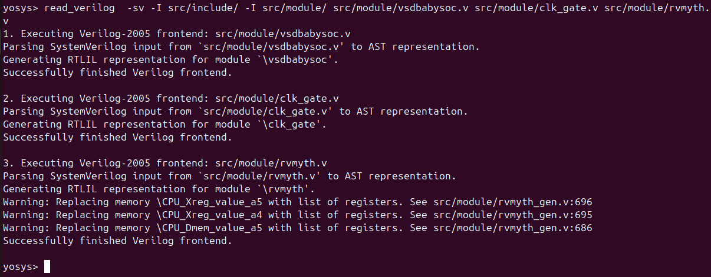
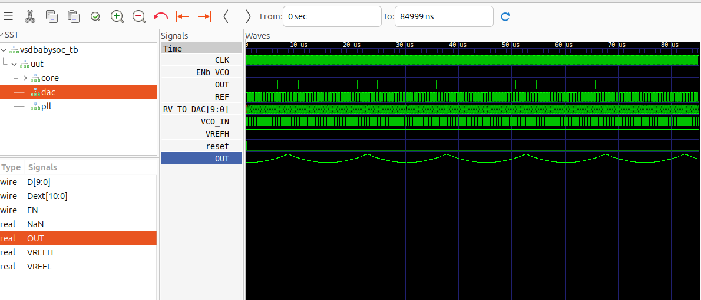

## Gate-Level Simulation (GLS) of BabySoC

### 🧩 Overview
**Gate-Level Simulation (GLS)** is performed after synthesis to verify that the BabySoC design functions correctly when represented at the gate level. Unlike RTL (Register Transfer Level) simulations, which operate at a higher abstraction, GLS works on the synthesized **netlist** — composed of actual logic gates and interconnections used in hardware implementation.

---

### 🎯 Purpose of GLS
The primary objective of GLS is to ensure that the synthesized design behaves exactly as intended, both functionally and temporally. It acts as a bridge between RTL verification and physical implementation.

---

### ⚙️ Key Features for BabySoC

#### 1. Timing Verification
- GLS utilizes **Standard Delay Format (SDF)** files to incorporate realistic timing delays.
- Timing simulations validate that the SoC performs correctly under real-world conditions and meets setup/hold requirements.

#### 2. Post-Synthesis Functional Validation
- Confirms that the logic functionality of the synthesized gate-level design matches the RTL version.
- Detects issues such as **metastability**, **glitches**, or **timing violations** that may not appear during RTL simulation.

#### 3. Simulation Tools
Common tools for performing GLS include:
- **Icarus Verilog** – for compiling and simulating the gate-level netlist.
- **GTKWave** – for visualizing and analyzing waveform outputs.

---


#### RTL Synthesis using yosys 

```bash
# Read verilog code
yosys> read_verilog  -sv -I src/include/ -I src/module/ src/module/vsdbabysoc.v src/module/clk_gate.v src/module/rvmyth.v

# Read Library
yosys> read_liberty -lib sky130_fd_sc_hd__tt_025C_1v80.lib

read_liberty -lib src/lib/avsddac.lib
 
read_liberty -lib src/lib/avsdpll.lib

# Synthesis
synth -top vsdbabysoc

# Post Synth generate
write_verilog vsdbabysoc_netlist.v

abc -liberty src/lib/sky130_fd_sc_hd__tt_025C_1v80.lib

show 
```

---
### Post-Synthesis Simulation

This stage verifies that the **synthesized gate-level design** behaves identically to the RTL model.

🔧 Simulation Setup
- **Compile** the synthesized netlist along with the standard cell library using **Icarus Verilog**.
- **Define Macro:**  
  -DPOST_SYNTH_SIM

#### Post Synthesis Simulation 


---
### 🧾 Pre-Synthesis vs Post-Synthesis Simulation

| Aspect | Pre-Synthesis Simulation | Post-Synthesis Simulation |
|:--|:--|:--|
| **Stage** | Before synthesis (RTL level) | After synthesis (Gate-level netlist) |
| **Input Files** | RTL source files (`.v`, `.sv`) | Synthesized netlist + Standard Cell Library |
| **Timing Information** | Ideal (no delays) | Includes real timing via SDF annotations |
| **Purpose** | Verify functional correctness of RTL | Validate gate-level behavior and timing accuracy |
| **Simulation Macro** | `-DRTL_SIM` | `-DPOST_SYNTH_SIM` |
| **Output** | RTL simulation log and `.vcd` waveform | Gate-level simulation output and `.vcd` waveform |
| **Speed** | Faster (high-level abstraction) | Slower (detailed gate-level model) |


