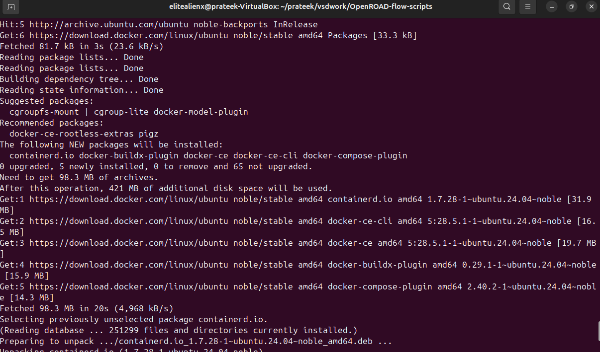
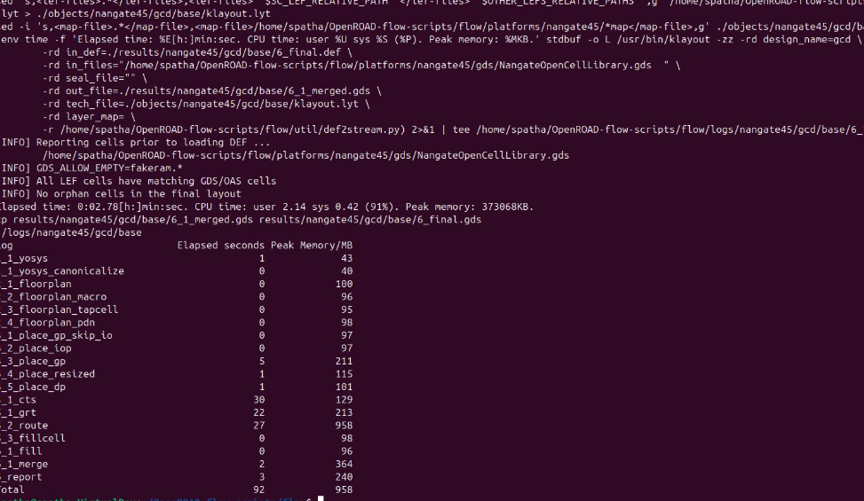
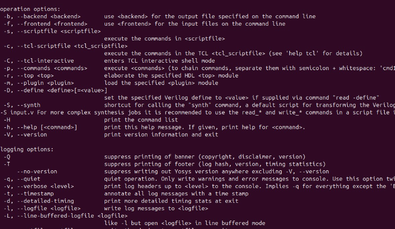

## 🏗️ OpenROAD Installation Guide

OpenROAD is an open-source, fully automated **RTL-to-GDSII flow** for digital integrated circuit (IC) design.  
It supports synthesis, floorplanning, placement, clock tree synthesis, routing, and final layout generation — enabling rapid design iterations for both **academic research** and **industry prototyping**.

---

---

### 🚀 Steps to Install OpenROAD and Run GUI


```bash
git clone --recursive https://github.com/The-OpenROAD-Project/OpenROAD-flow-scripts
cd OpenROAD-flow-scripts

sudo ./setup.sh

./build_openroad.sh --local

source ./env.sh
yosys -help  
openroad -help

cd flow

make gui_final
```



